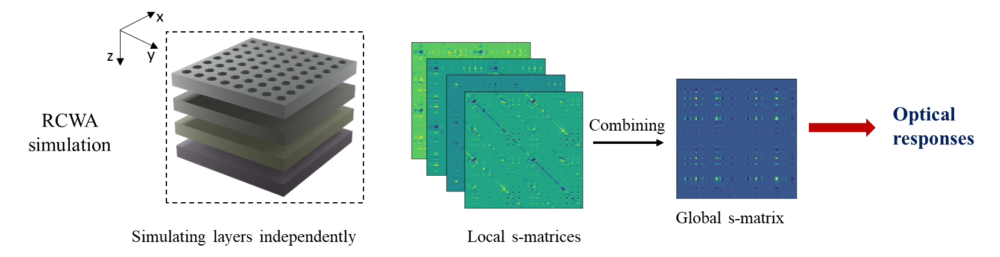
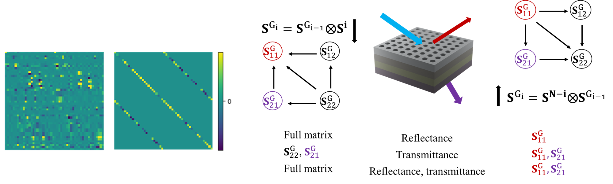

# RCWA: 

We present an efficient RCWA simulation of 3D nanostructures
* Fast simulations for multilayers 
* Simple, easy to use: we need only 2 lines for the main part of the simulation

## Multilayer simulations:
The RCWA method involves the semi-discretization of Maxwell’s equations in Fourier space to compute the scattering matrix (s-matrix) of layers and combine these multiple s-matrices into a global one to quantify the expected optical responses.



While the computation of a homogeneous layer is simple without solving the eigen decomposition, handling a stack of homogeneous layers could be a numerical issue in 3D structures, as these layers involve expensive matrix algebra to connect to the grating layers.

We applied two techniques: vector-based computation and bottom-up construction. The vector-based computation compactly represents matrices involved in computing homogeneous layers by the vector of four diagonal elements. The bottom-up construction can reduce the elements of the global S-matrix to quantify optical responses.



## Simple, easy to use
#### Simulation
The main part of the simulation requires only  2 lines in a loop of wavelengths. Then, the optical responses are easily calculated from the global S-matrix.   

Call the function:
```python
sim=rcwa()
```
Main part:
```python
for wth in range(len(wavelength_range)):            
    S_layer=sim.S_layer(Structure,idx=wth)  
    S_global=sim.S_System(S_layer)
 ```
The notebook examples are located in [Example](Example). Two versions: simulation and faster simulation can be found in the notebook examples. The faster simulation utilizes advanced techniques: vector-based computation and bottom-up construction to simulate the required elements of the global S-matrix.

## Contact
The RCWA simulation is still in development, so please expect some bugs. If you encounter any issues, feel free to contact me: phamhoanglam.fr@gmail.com
